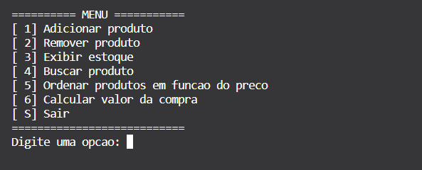
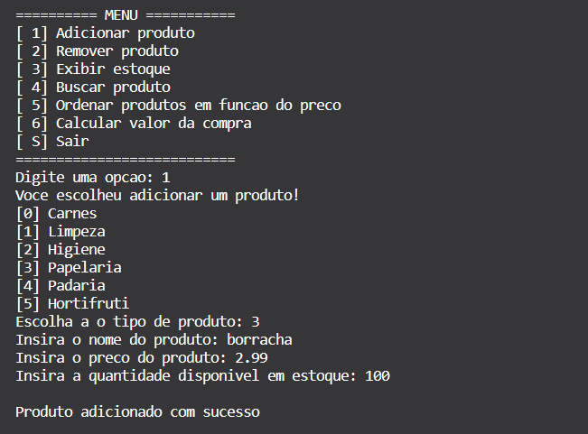
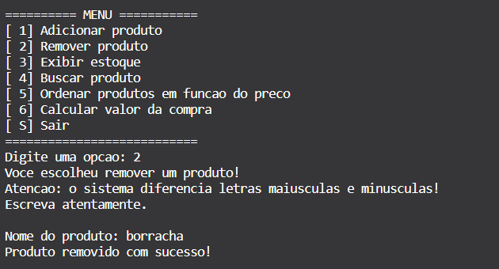
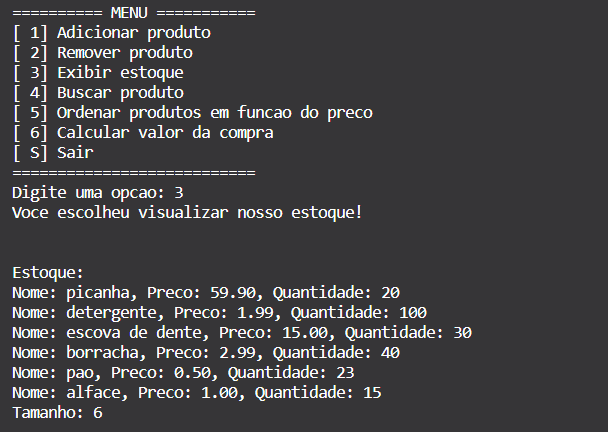
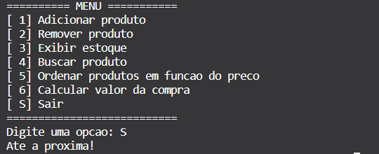

# INF0286 - Algoritmos e Estruturas de Dados 1
# A03 - Seminário

Prof. Dr. Aldo André Díaz Salazar (aldo.diaz@ufg.br)

## Equipe Team 1
Integrantes:

\<MATRÍCULA\> - \<NOME-COMPLETO\>

202200513 - Giordana de Farias Franco Bueno Bucci  
202200516 - Guilherme Tavares Monteiro  
202200491 - Ana Luísa de Bastos Chagas  
202200550 - Pedro Lemes Sixel Lobo  

## PROJETO: Softwre de Gerenciamento de Estoque de Mercearia

<!--- Coloquei aqui, incrementalmente, a documentação do seu projeto --->

<i><b>Abstrct</b>: Construction of a grocery store inventory management software, categorizing each product by its usefulness, informing its name, quantity, price and belonging category. It has an interactive menu for easy use. Use of doubly linked lists, modularization, memory allocation, all in C language.</i>

<i><b>Keywords</b>: Inventory, Management, Software, Supermarket, Products</i>

### 1.Introdução

 A proposta deste trabalho foi fazer um sistema de aplicação real utizando os conhecimentos adquiridos nas aulas de Algoritmo e Estrutura de Dados I e apresentá-lo em sala de aula. Com isso em mente, a solução pensada pelo grupo para o seminário consiste em um software para gerenciamento de estoque de mercearia
ou empório, após a observação da quantidade de comércios que não possuem ferramentas necessárias para facilitar a organizalçao do estoque do estabelecimento. 

 Esse sistema foi feito com estruturas condicionais, estruturas de repetição, alocação dinâmica de memória, ponteiros, vetores, moularização, tipos abstratos de dados (TAD), listas duplamente encadeadas e métodos de ordenação - conteúdos aprendidos e aprofundados durante as aula práticas e teóricas - em sua criação. Além disso, esse gerenciador possui um menu interativo e intuitivo no começo do programa com as operações a serem realizadas, no qual cada número corresponde a uma operação. Esee menu tem funções primordiais para controle de estoque, como adicionar itens, remover itens, buscar por itens no estoque, mostrar o estoque ordenado por preço e calcular o valor total de uma compra com os itens disponíveis em estoque.

 Este relatório é dividido em 5 seções. Na seção 2, será explicado cada estrutura utilizada na programação desse sistema. A seção 3 falará sobre a metodologia utilizada para o desenvolvimento dese gerenciador, isto é, como utilizamos cada estrutura da programação para fazer com que o sistema fizesse cada ação. Na seção 4, será abordado os resultados e discussão sobre o trabalho. Por fim, na seção 5 será exposta a conclusão referente à este trabalho.
  

### 2.Fundamentos Teóricos

 Na Introdução, foi mencionado quais estruturas da programação foram utilizadas para a solução encontrada pela equipa para o trabalho proposto. Nesse sentido, discutiremos e explicaremos de maneira simples e intuitiva cada uma delas.

 As estruturas condicionais são estruturas de controle de fluxo que permitem que o programa execute diferentes ações e mude seu comportamento durante sua execução com base nas condições abordadas. As estruturas condicionais são <code>if()</code>, <code>else if()</code>, <code>else</code> e switch case. 

 As estruturas de repetição são estruturas que permitem a execução de uma parte do código mais de uma vez, até que o critério de parada seja obtido. O trecho do código dentro da função é executado quantas vezes for necessário, e as estruturas usadas são: <code>while</code>, <code>for</code> e <code>do while</code>.

 A alocação dinâmica de memória: Gerenciamento manual de memória por meio de funções da biblioteca &ltstdlib.h&gt com malloc, que aloca espaço para um bloco de bytes consecutivos na memória RAM do computador e devolve o endereço desse bloco, calloc, o qual realiza a mesma ação do malloc, mas também faz com que o espaço alocado seja inicializado com zeros, realloc, que altera durante a execução do programa o tamanho de um bloco de bytes alocado anteriormente, e free, que libera a memória ocupada por variáveis alocadas dinamicamente.

 Os ponteiros são variáveis que armazenam o endereço de memória de outras variáveis, permitindo que sejam acessadas em diferentes partes do programa.

 A modularização é a divisão do software em partes, chamadas módulos, que interagem entre si e cada um empenha uma funcionalidade específica - como um módulo com a declaração das funções e structs utilizadas, outro com o conteúdo das funções e outro com a execução delas. Isso permite melhorias na organização, manutenção e testabilidade do código.

 O Tipo Abstrato de Dado (TAD) é uma especificação de um conjunto de dados e operações que podem ser executadas sobre esses dados.

A lista linear duplamente encadeada é uma estrutura de dados composta por uma série de nós, os quais podem armazenar um ou mais dados, e possuem dois ponteiros, sendo um para o nó anterior e outro para o nó seguinte, permitindo que a lista seja percorrida a partir do seu início ou a partir do seu fim.

 Os métodos de ordenação são algoritmos de manipulação de dados utilizados para organizá-los em uma ordem específica. Podem ser aplicadas em listas e vetores, por exemplo, e variam de acordo com complexidade e tempo de execução. Os métodos mais comuns são: bubble sort, selection sort, quick sort, insertion sort e merge sort.
  

### 3.Implementação de Algoritmos e Desenvolvimento

 A organização das informações do estoque é crucial para um ótimo gerenciador. Nesse sentido, foi-se utilizado uma lista duplamente encadeada para armazenar as informações dos produtos presentes no estoque. Esse modo de guardar informações foi escolhido por trazer maior facilidade de em percorrer os elementos (tanto do elemento inicial para o final quanto do elemento final para o inicial).

 Sabe-se também que o estoque de uma mercearia não é algo estático e está sujeito a constantes mudanças. Existe sempre a possibilidade dee adicionar novas variedades de produtos, deixar de vender outras, fazendo como que seja necessário uma atualização do seu inventário. Com isso em mente, o gerenciador apresenta funções de adicionar e remover produto do estoque, para conseguir comportar essa dinamicidade do mercado.

 Além disso, conferir a existência ou não de determinados produtos é de extrema importância para os comércios, a fim de não gerar erros de gestão, como oferecer a venda de algo que não existe, ou deixar de vender algo que existe e acabar perdendo o produto. Nesse pensamento, o sistema possui uma função de busca, para checar se realmente tem em estoque o produto procurado.

 Outro ponto importante, na organização da disposição dos produtos. Na maioria das vezes o cliente tem um limite para o gasto nas compras e, por isso, há a necessidade de querer economizar. Contudo, com a grande variedade de produtos, pode ser difícil para o cliente encontrar os de menor preço, ou na faixa de valor que deseja. Por isso, o software apresenta a função de ordenar os itens do estoque por preço.

 Somado a isso, o momento final de uma compra é o pagamento dela, e o cálculo correto deste valor total é crucial. Caso o valor seja calculado de forma errônea o proprietário da mercearia pode receber prejuízos financeiros (valor calculado ser menor que o correto), perder clientes, ou até sofrer processos judiciais (valor calculado acima do correto). De modo a prevenir isso, o gerenciador também apresenta uma função para calcular o valor total da compra, levando em consideração os itens e a quantidade de cada um a ser escolhida pelo comprador.
  

### 4. Resultados e Discussão

   
A figura abaixo ilustra o menu inicial, que mostra para o usuário as opções disponíveis para o gerenciamento do estoque.

   
    

   
A figura abaixo mostra como a função e adicionar um produto ao estoque é utilida pelo usuário final

   
    

   
A figura abaixo ilustra o que i gerenciaor exibe ao remover um item do estoque com sucesso.

   
    

   
A figura abaixo mostra o resultado final da exibição do estoque cadastrado.

   
    

   
A figura abaixo ilustra a saída do usuário do gerenciador de estoque.

   
    
   
   
Aqui temos apenas alguns exemplos do código em funcionamento, para informções completas leia o relatório técnico.

### 5. Conclusão

O resultado esperado foi obtido com êxito. Com o gerenciador foi possível categorizar, ordenar e controlar todos os produtos de maneira correta. Além disso, o trabalho foi de grande importância para aplicar os conhecimentos adquiridos ao longo das aulas de Algoritmo e Estrutura de Dados 1. Toda a equipe participou ativamente em todos os processos, sendo eles: criação das ideias, planejamento de funções, codificação, escrita e até a apresentação do projeto.
  

### Referências

TENENBAUM, A. M., LANGSAM, Y., AUGENSTEIN, M., Estruturas de Dados Usando C, São Paulo , Makron Books, 1995.

